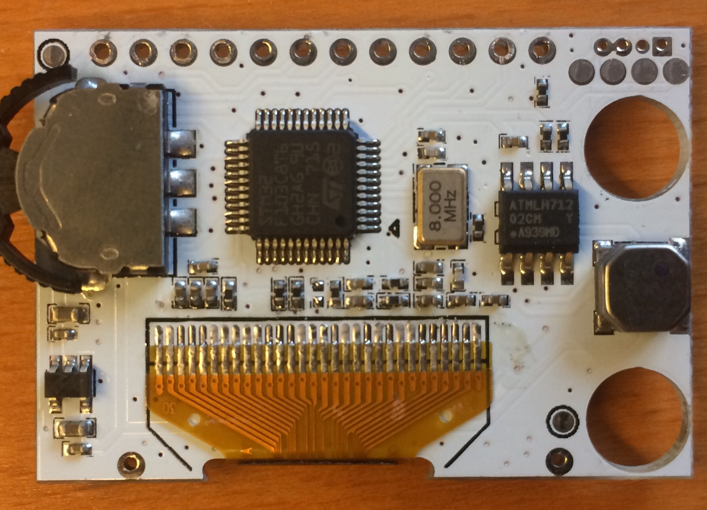
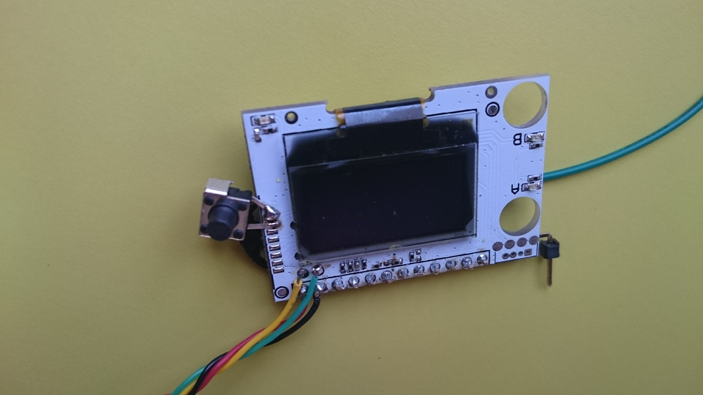
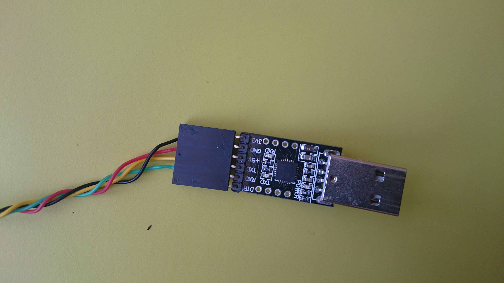
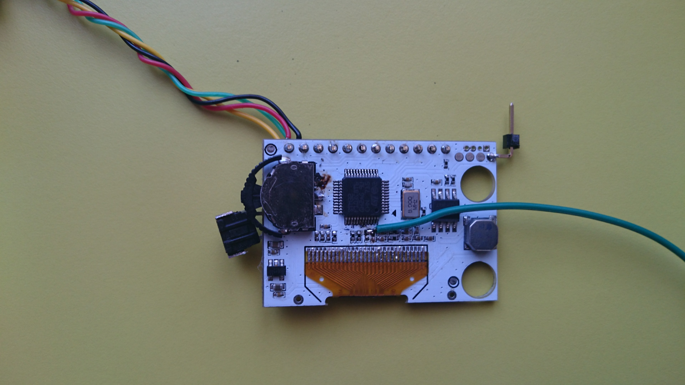

How to connect to STM32

# 

# 

Thanks ove_ from RCG for the pictures!

Option 1 - SWD

See pictures for SWD pins

Option 2 - Internal serial bootloader

See pictures above for TX and RX pins. Connect here 3V3 USB->UART converter.
Button on the side is NRST a.k.a RESET.

# 
# 

Than connect BOOT pins accordingly - green wire soldered close to STM32. And desolder the resistor as marked by red circle on the picture above.

# 

When it is connected to 3V3 ( tiny pinheader soldered to the side) -> Bootlader is active after reset, for normal operation keep it unconnected.
