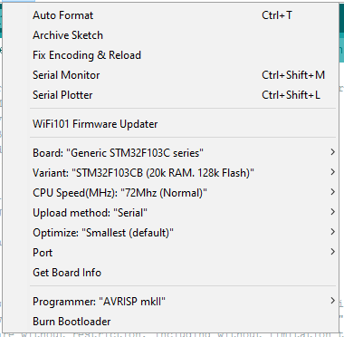

Follow this video

https://www.youtube.com/watch?v=MLEQk73zJoU&t=297s

Set the Arduino accoring to the picture

# 

Don't mind the processor suffix is CB. On the board is C8 - but it is just a name. ST puts same silicon inside :) Otherwise we are not able to fit the code inside the chip

In installed library for STM32 change in library folder under STM32F103 files for display

Path:.\Arduino\Hardware\Arduino_STM32-master\STM32F1\libraries\Adafruit_SSD1306

From

//HardWire HWIRE(1,I2C_FAST_MODE); // I2c1

HardWire HWIRE(2,I2C_FAST_MODE); // I2c2

To

HardWire HWIRE(1,I2C_FAST_MODE); // I2c1

//HardWire HWIRE(2,I2C_FAST_MODE); // I2c2

//note not neccessary now, library is part of the project
